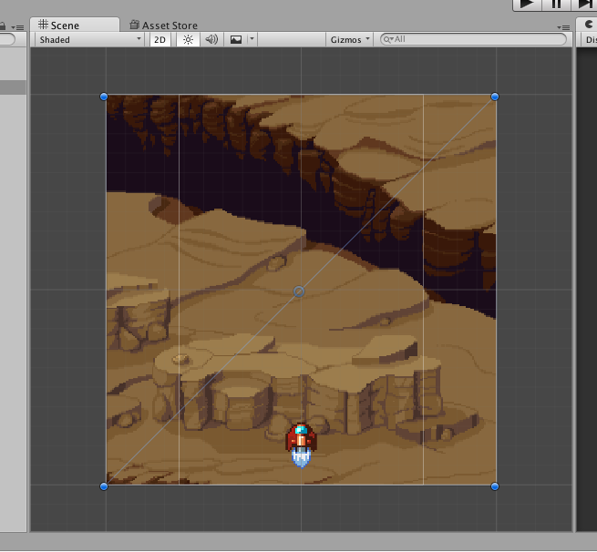

# 배경 스크롤 구현하기

유니티에서 배경 스크롤을 Material의 텍스쳐 오프셋을 지속적으로 바꿔서 스크롤되게 구현할
수 있었다.

2D Sprite를 사용하면 두 객체 2개의 위치를 번갈아가면서 이동해서 구현할 수 있지만,
더 간단하게(?) 구현하려면 텍스쳐의 오프셋을 사용해서 구현할 수 있다.

텍스쳐를 사용해 구현하려면 Quad를 사용해서 텍스쳐를 붙여넣어야 한다.


텍스쳐의 설정인데, 원래는 텍스쳐가 영역을 넘어서면 그 부분부터 잘리게 된다. 하지만
텍스쳐의 Wrapping Mode를 Repeat으로 설정하면 해당 부분부터 텍스쳐의 처음 부분부터
렌더링되게 된다.

이렇게 텍스쳐를 설정하고 Material을 만드는데, 빛의 적용을 받지 않는
`Particle/Alpha Blended`를 사용했다.

Material을 만든 뒤, Quad를 Scene에 넣고 Material을 설정하면 우리가 원하는 배경이
나온다. 하지만 스크롤은 여전히 되지 않는다.



그래서 스크립트를 사용해서 텍스쳐의 오프셋을 직접 변경해주어야 한다.

```cs
using UnityEngine;
using System.Collections;

public class BackgroundScroller : MonoBehaviour {

	public float scrollSpeed = 1.5f;
	Material material;

	// Use this for initialization
	void Start () {
		material = GetComponent<Renderer> ().material;
	}

	// Update is called once per frame
	void Update () {
		material.mainTextureOffset += Vector2.up * scrollSpeed * Time.deltaTime;
	}
}
```

간단하게 구현할 수 있었다.
이렇게 컴포넌트를 만든 뒤 Quad 객체에 추가해주면 스크롤이 되는걸 볼 수 있다. ~~참 쉽죠?~~
