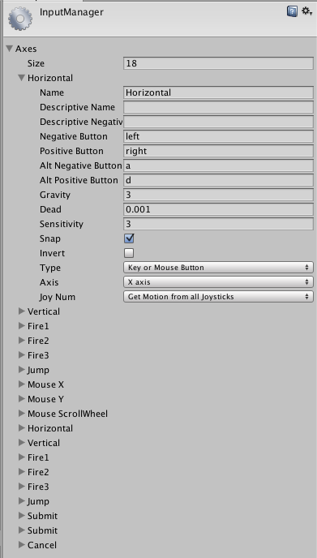

# 캐릭터 움직이기

배경을 구현한 뒤에는 캐릭터를 좌우로 움직이는 것을 구현할 차례다.

`PlayerMover` 컴포넌트를 만든 뒤 캐릭터 객체에 적용한다.

```cs
using UnityEngine;
using System.Collections;

public class PlayerMover : MonoBehaviour {

	public float moveSpeed = 0.5f;

	// Use this for initialization
	void Start () {

	}

	void MoveControl() {
		float moveX = moveSpeed * Time.deltaTime;
		transform.Translate (moveX, 0, 0);
	}

	// Update is called once per frame
	void Update () {
		MoveControl();
	}
}
```

적용하고 나면 캐릭터가 오른쪽으로 움직이는 걸 볼 수 있다. `moveX`에 -1를 곱하면
어떻게 될까? 당연히 캐릭터가 왼쪽으로 움직이는 걸 볼 수 있다.
```cs
float moveX = moveSpeed * Time.deltaTime * -1;
```

moveX에 키보드 입력에 맞춰 -1 ~ 1 사이의 값을 곱하면 좌우로 이동하는 것을 구현할 수 있다.
그런데 우리가 직접 키보드 입력에 맞춰 이 값을 구하는 걸 구현해야 할까?

Unity에서는 키보드/컨트롤러 입력을 손쉽게 받을 수 있게 도와주는 `InputManager`라는
싱글톤 클래스가 존재한다.



`InputManager`는 감소, 증가 키를 받아서 -1 ~ +1 사이의 값을 알아서 구해주는 기능을 한다.
`Horizontal`을 보면 Negative, Positive가 각각 좌, 우 방향키로 설정된 걸 볼 수 있다.

왼쪽 방향키를 누르면 `Horizontal`의 값이 -1으로 이동하고, 오른쪽 방향키를 누르면 1로
이동하게 된다.

이 값을 그대로 `moveX`에 곱하면 입력을 바로 구현할 수 있게 된다.

```cs
float moveX = Input.GetAxis("Horizontal") * moveSpeed * Time.deltaTime;
```

아까 우리가 (혹은 Unity가 알아서 붙인) `Horizontal`이라는 축을 가져오면 우리가 원했던
-1와 +1 사이의 값이 바로 튀어나온다. 곱하면 끝이다!

실제로 실행해서 좌, 우키를 누르면 키보드에 맞춰 이동하는 걸 볼 수 있다.

마찬가지로 `Vertical` 축을 `moveY`를 만들어서 연동하면 세로로도 이동할 수 있게 된다.
