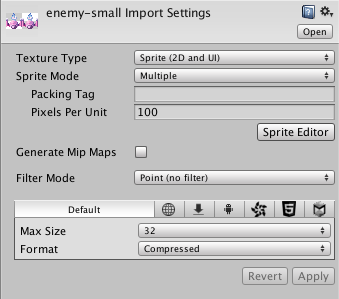
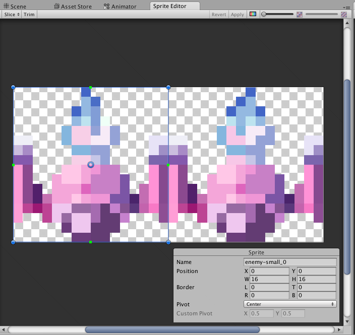
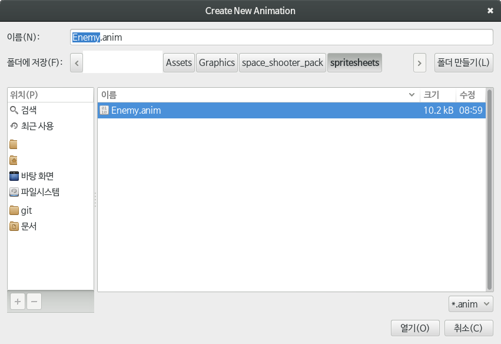
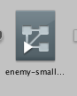
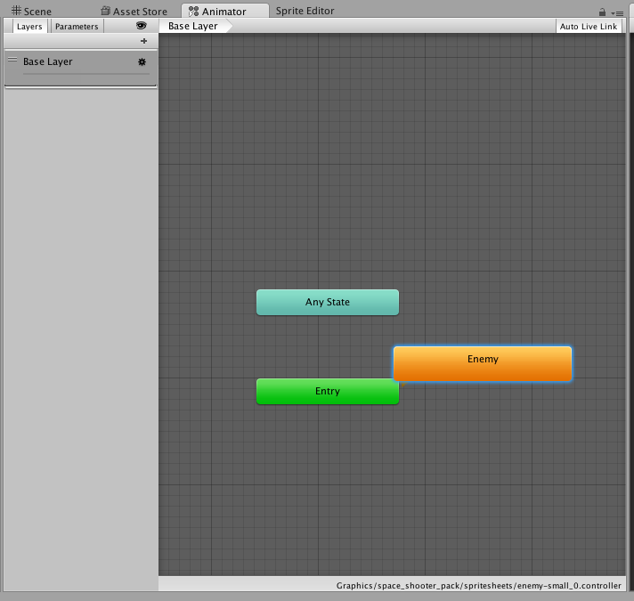

# 적 캐릭터 움직이기

적 캐릭터를 움직이려면 당연히 적 캐릭터가 있어야 하므로 적 캐릭터를 만들어보자.

일단 적 캐릭터 텍스쳐를 선택해서 적당히 설정하고 크롭한다.




크롭한 뒤 해당 스프라이트를 선택하고 장면에 끌어 넣는다. 파일 선택 창이 뜨는데
아무 파일 이름이나 집어 넣어서 애니메이션 파일을 만든다.



선택하고 나면 장면에 적 캐릭터가 등장하는데 이대로 실행해보면 적 캐릭터가 움직이는
걸 볼 수 있다.

하지만 속도가 너무 빨라서 애니메이션의 속도를 늦추려고 한다. 애니메이션 컨트롤러를
선택해서 연다.



Animator에서 애니메이션 이름을 선택해서 속도를 조정하면 속도가 늦춰지게 된다.



그 뒤에는 적을 캐릭터쪽으로 움직이게 만드는데, 이건 2번째에서 다룬 캐릭터 움직이기와
비슷하므로 생략한다.

```cs
using UnityEngine;
using System.Collections;

public class EnemyController : MonoBehaviour {
	public float moveSpeed = 0.5f;
	// Use this for initialization
	void Start () {

	}

	void MoveControl() {
		float yMove = moveSpeed * Time.deltaTime;
		transform.Translate (0, -yMove, 0);
	}

	// Update is called once per frame
	void Update () {
		this.MoveControl ();
	}
}
```
