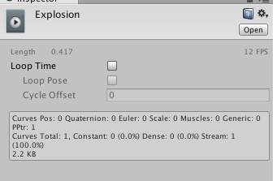

# 폭발 효과 구현하기
폭발 효과를 구현하려면 일단 폭발 텍스쳐를 준비해야 한다.
폭발 텍스쳐를 만들어서 애니메이션을 적용하는 것은 [3강](./3-enemy-animation.md)에서 한
것과 동일하다. 하지만 애니메이션 객체에서 Loop Time을 체크 해제해서 애니메이션이 1번만
반복되게 해야한다.



폭발 텍스쳐를 만들고 난 뒤에는 스크립트를 만들어서 애니메이션이 끝나고 알아서 사라지게 하자.

```cs
using UnityEngine;
using System.Collections;

public class Explosion : MonoBehaviour {

	// Use this for initialization
	void Start () {
		Destroy (this.gameObject, 0.8f);
	}

	// Update is called once per frame
	void Update () {

	}
}
```

`Destroy` 함수에 `0.8f` 매개변수가 더 붙어있는데,

```cs
Destroy(GameObject, float)
```

을 사용하면 해당 시간이 지난 후에 해당 객체가 삭제되게 된다.

엔티티와 스크립트 작성이 끝난 뒤에는 Assets 폴더에 Prefabs 폴더를 만들고 거기에
엔티티를 끌어다 놓으면 Prefab이 생성된다. Prefab을 만들면 해당 객체를 템플릿처럼
언제든지 소환할 수 있게 된다.

Prefab이 만들어진 뒤에는 엔티티를 삭제해도 된다.

이제 플레이어와 적이 충돌할 때 폭발 효과가 나도록 처리한다.

```cs
	public GameObject explosionPrefab;
```

플레이어 스크립트에 위와 같은 줄을 넣어서 `explosionPrefab`에 방금 만든 폭발 효과 엔티티
Prefab을 바인딩한다.

그리고 충돌 효과가 일어날 때 해당 객체를 생성하면 된다.

```cs
Instantiate (explosionPrefab, transform.position, Quaternion.identity);
```

이제 서로 충돌하면 폭발 효과가 나오는 것을 볼 수 있다.
