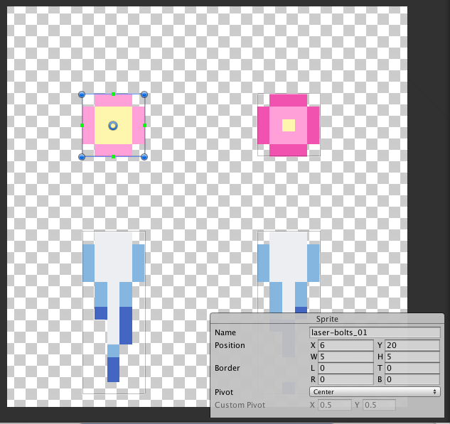

# 총알 발사하기

일단 총알을 발사하려면 [4강]과 (./4-enemy-collision.md)과
[5강](./5-explosion-effect.md)에서 한 것처럼 Prefab을 만들어야 한다.



마우스로 이미지를 직접 끌어서 스프라이트를 직접 자를 수 있다.

스프라이트를 자르고 애니메이션을 설정하고 태그를 붙이고 Collider를 붙이고 위로 움직이게
코드를 만들면 된다.

```cs
using UnityEngine;
using System.Collections;

public class Laser : MonoBehaviour {
	public float moveSpeed = 0.45f;
	// Use this for initialization
	void Start () {

	}

	// Update is called once per frame
	void Update () {
		transform.position += Vector3.up * moveSpeed * Time.deltaTime;
	}
}
```

Laser Prefab을 만든 뒤에는 캐릭터가 이 Prefab을 계속해서 쏘도록 만들어야 한다.

```cs
public GameObject laserPrefab;
public bool canShoot = true;

float shootDelay = 0.5f;
float shootTimer = 0;
```

캐릭터 코드에 laserPrefab을 선언해서 방금 만든 Prefab을 넣자. 그리고 ShootControl이라는
함수를 만들어서 넣는다.

```cs
void ShootControl() {
  if (!canShoot)
    return;
  if (shootTimer > shootDelay) {
    Instantiate (laserPrefab, transform.position, Quaternion.identity);
    shootTimer -= shootDelay;
  }
  shootTimer += Time.deltaTime;
}
```

shootTimer를 계속 더하다가 threshold값을 넘어서면 레이저 객체를 복사하는 구조로 만들어져
있다.

이를 `Update` 함수에서 호출해주면 된다,
